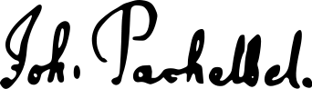

```{r include=FALSE}
library(knitr)
opts_chunk$set(echo = FALSE)
```


```{r logo, out.width="15%", fig.align='center'}

```

\LARGE \center \bf CERTIFICATE OF ATTENDANCE

\normalfont
\vspace{10mm}

\Large
Herewith, we certify that **`r params$attendee`** has participated in the `r params$event` that took place `r params$date` in `r params$place`.

\vspace{15mm}

```{r firma, out.width="20%", fig.align='center'}

```

\normalsize

`r params$signer`

`r params$role`

